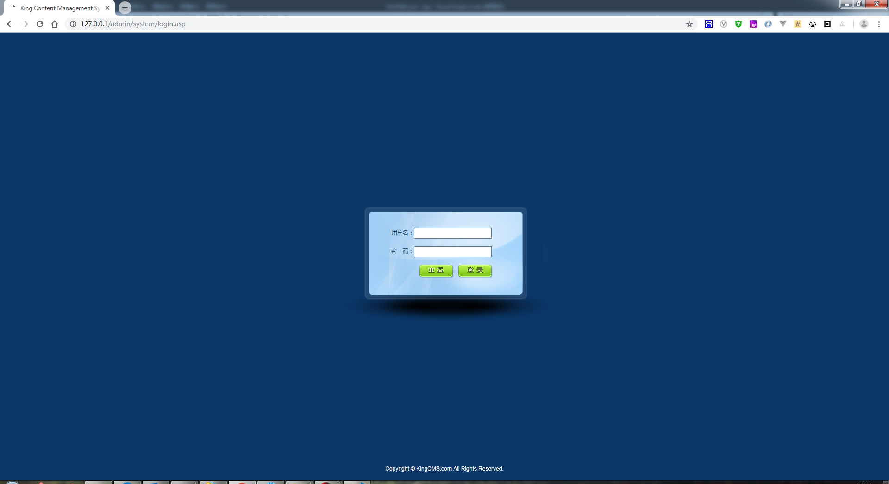
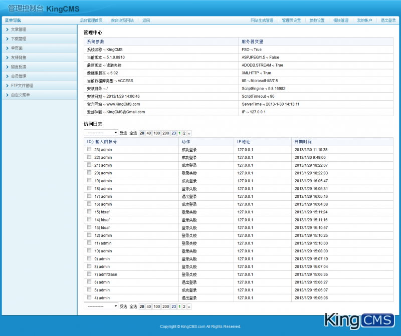
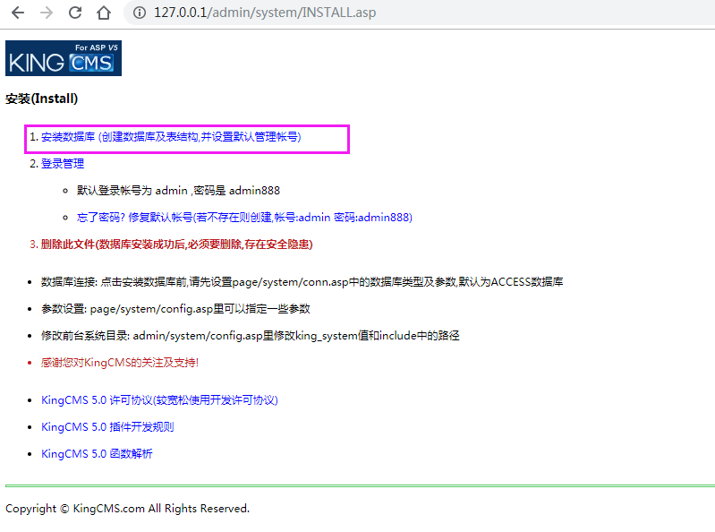
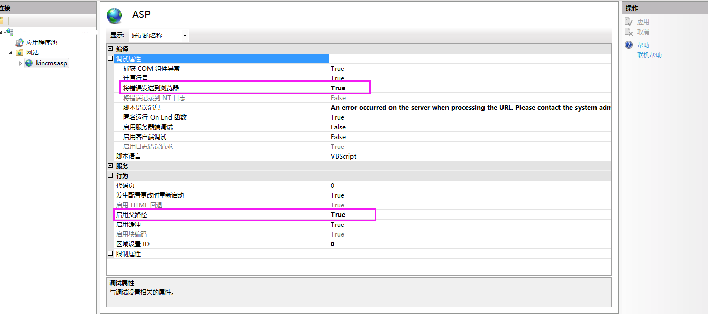
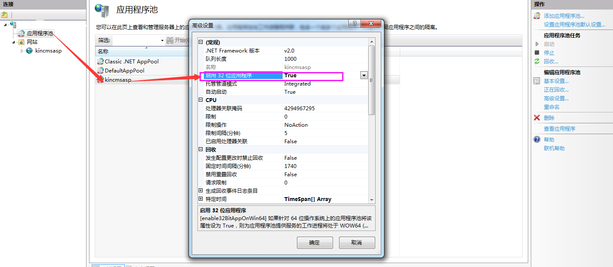
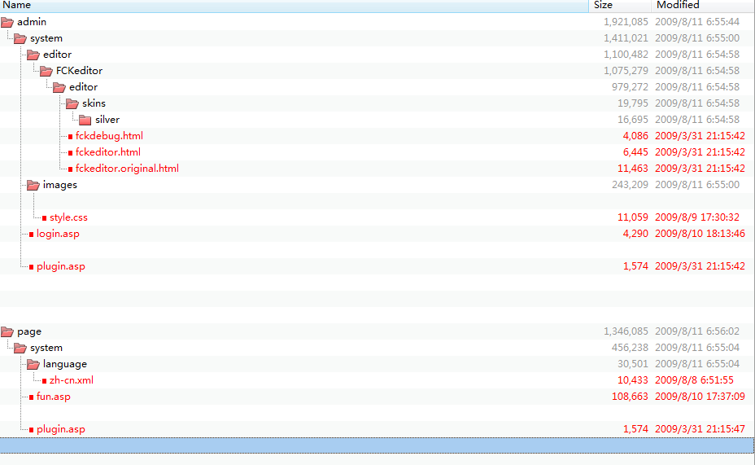

# kingcms asp 后台模板

整理代码，发现还有这么套模板，也时不时的有人加我QQ索要，发上来有需要的自己下吧（虽然asp已经老老老....掉牙了）， 用于简单的企业站还是可以的，但kingcms已经是10年前的，慎用，有bug自己解决

kingcms 官方的UI是很简单的，木有美可言~不述

改版后的：





# 安装使用

+ 使用IIS（注意父路径设置为True)
+ 执行安装 http://127.0.0.1/admin/system/INSTALL.asp  (安装完后INSTALL.asp会被删除)

  注意：如果根目录下存在/db/目录，INSTALL.asp将没有安装选项，如下图

  
+ db.bak目录有安装好各模块的空数据库，不想一个个安装模块，可用它替换（如果模块不能用，请重新安装）
+ 登录 http://127.0.0.1/admin/system/login.asp
+ 默认用户: admin / admin888
+ 自定义菜单: 
    ```
    文章管理|../Article/
    下载管理|../download/
    单页面|../onepage/
    友情链接|../link/
    留言反馈|../feedback/
    会员管理|../passport/
    FTP文件管理|../webftp/
    自定义菜单|../system/manage.asp?action=diymenu
    ```

# 安装问题：
+ asp An error occurred on the server when processing the URL. Please contact the system administrator
    **解决**

    打开【asp】【调试属性】【将错误发送到浏览器】=> True

    打开【asp】【行为】【启用父路径】=> True

    

+ “Microsoft OLE DB Service Components” Hresult: 0x80040154
   
   **解决**

    打开【应用程序池】【自己的网站名称上右键“高级设置”】【启用32位应用程序】=> True

    


# 后台管理样式更改说明

+ /template/目录下面添加了skin文件夹，这里是一些预载js、css及图片

+ 修改了/admin/system/images/style.css
  style.bak.css为原始备份

+ 修改了/admin/system/login.asp
  login.bak.asp为原始备份

+ 修改了/page/system/fun.asp
  fun.bak.asp为原始备份

+ IE下管理台首页JS bug修复。

+ IE下管理台主内容区域显示不完全问题。

  

# 版权声明
+ 此代码修改仅供学习，请保留kingcms版权说明
+ 商业应用请购买正版(www.kingcms.com)
+ 原版下载: https://www.kingcms.com/download/asp/