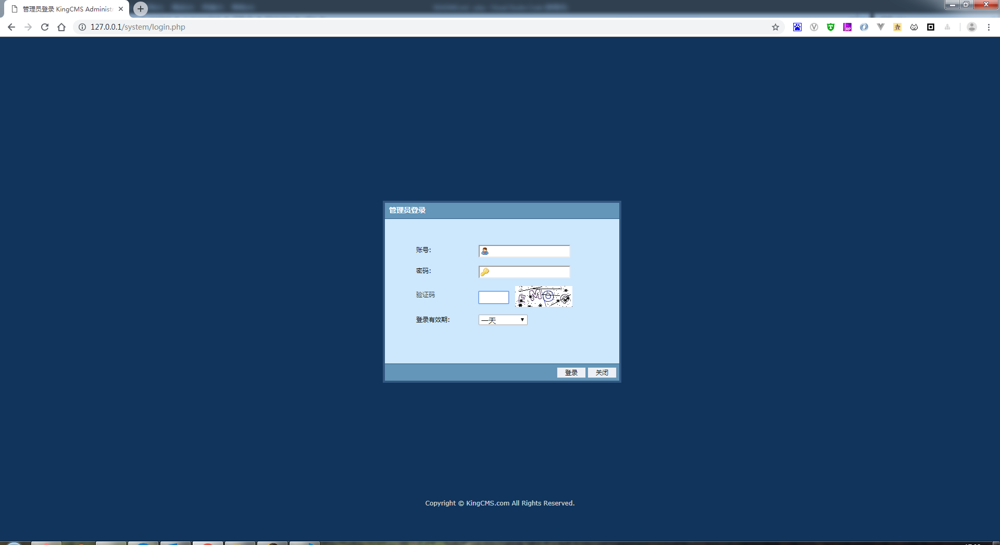
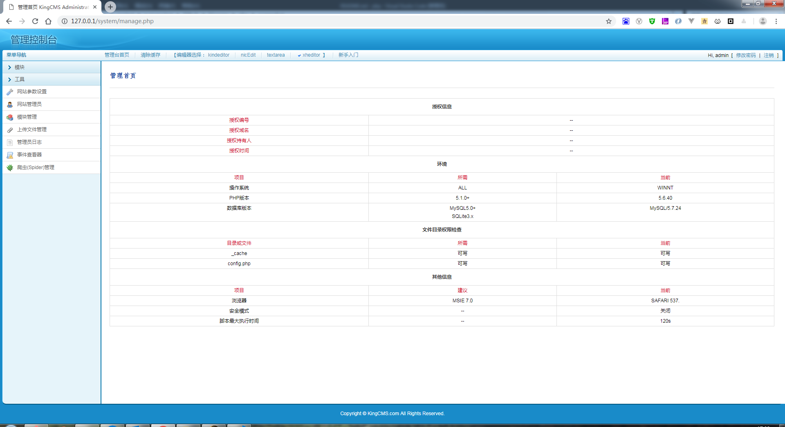

# kingcms php 后台模板

跟asp版本一下，php版也有个后台UI的改版

kingcms 官方的UI是很简单的，木有美可言~不述

改版后的：





# 安装使用

+ 环境可以直接使用`wampserver`(https://sourceforge.net/projects/wampserver/)
   
  下最新的wampserver肯定是跑不了的，用这个吧，旧是旧了点，能用

  百度网盘：https://pan.baidu.com/s/1Lxq7wXBVN4iM9qI3MXldmQ 
  提取码：n6ok

+ 执行安装 http://127.0.0.1/install.php (安装完后INSTALL.asp会被自动删除)

  安装了上面的wampserver版本，只能用127.0.0.1访问
  
  install.php.bak是install.php的备份

+ 登录 http://127.0.0.1/system/login.php
+ 默认用户: admin / admin888

# 说明（15:30 2013-10-22）

+ 此版本为KingCMS 企业(PHP) 6.1.1641(Sp2)的修改版本

+ 修复或增加的内容

  1.修复前一个版本浏览器不兼容问题

  2.修复kingcms本身bug=>单击有二级栏目的菜单，重复单击，二级菜单重复生成的问题

  3.增加上传功能=> 左侧"工具" => "上传文件管理" => 上传文件

  4.同时添加"文件管理器"按钮

  5.增加左侧导航栏定位功能

  6.修复kingcms本身及后台模板存在的细小BUG，这里不一一列出了

  7.使用过程中，如果有任何其他Bug，欢迎反馈给我

+ 扩展

  增加留言内容自动发送到指定邮箱，减少频繁登录后台查看留言的繁琐，参考(http://www.cnseafreight.com/service/inquiry.html)
  默认关闭，需要请参考feedback/index.sendEmail.php的代码

# 修改（11:21 2015-07-26）

1、模板标签帮助:
/api/help/index.html

2、官方程序:
/api/download/KingCMS_6.1.1641(Sp2).zip 
【请不要拿官网站程序替换，否则会出错。现有程序已经修复很多bug的版本。官方版本只用来做参考】

/system/lib/kc_skin_class.php  425行

3、修复一级栏目调用二级栏目所有文章并分页
(1)\portal\core.class.php   添加listid1字段（父级分类id）到king__Article表,并查询出来。用本修改程序install.php安装
即可自动添加listid1字段到king_Article表
1276、1277、1401、1405、1407、3331行有修改

(2)\portal\manage.content.php  添加文章页面加入listid1字段，文章保存时提交到king_Article表
1061-1064、1125、1198、1201行有修改

(3)模板调用:
```
<ul class="clearfix">
    {king:portal.article type="list"}
    <li>
        <a href="{king:path/}" title="{king:title/}">
        
        <span>{king:title size="70"/}</span>
        </a>
    </li>
    {/king:portal.article}
</ul>
<div class="m-page">
{king:pagelist}
        {king:First replace="First|第一页"/}
        {king:standard/}
        {king:Next/}
        <p>共<b>{king:pagecount/}</b>页 <b>{king:count/}</b>条</p>
{/king:pagelist}
</div>
```

4、修复后台栏目删除bug
\portal\manage.php  90行


5、隐藏“后台-帮助菜单" 

system/lib/kc_skin_class.php

搜索"k_mainmenu",去掉左侧菜单 mainMenu的UL，并为li添加class="k_menu_i";()

6、webftp/manage.php   

	234行添加跳转按钮：
	
	$s.="<div class=\"ftp_upload_file\"><a href=\"../system/manage.php?action=upfile\" 上传文件管理</a></div>";

	

    1816行，添加上传文件按钮到“工具”-》“上传文件管理”菜单页面

	$left[]=array(
			'href'=>'../system/manage.php',
			'ico'=>'a7',
			'title'=>'上传文件',
			'class'=>'k_ajax',
			'rel'=>"{URL:'../system/manage.php',CMD:'brow',id:'ktemplatelist1',path_def:'template/',jsfun:'',is:0,filetype:0,VAL:''}"
	);


7、system/lib/kc_template_class.php   35行，注释掉jquery.kc.js、jquery.js的自动添加代码。改为在模板中手动添加这些

8、system/manage.php 1095行 添加,上传选择文件时，把文件名写入到后面的input中

	<script>
		$(document).ready(function(){
			$(\".k_up\").on(\"change\",function(){
				$(this).closest(\"tr\").find(\".k_in\").val($(this).val());
			});
		});
	</script>
9、system/js/jquery.kc.js  107行，修复后端全选/反选功能


10、修复多次请求的问题

   system/js/jquery.kc.js   
   
   第300行添加   $.kc_ajax_text = "";
   
   第302行添加    
   		if($.kc_ajax_text ==Rel){
			return;
		} 
    第377行添加 $.kc_ajax_text = "";
	
	
	portal/manage.php
	
	第56行 添加 $('#tr_{$info['listid']}').remove();


# 版权声明
+ 此代码修改仅供学习，请保留kingcms版权说明
+ 商业应用请购买正版(www.kingcms.com)
+ 原版下载: https://www.kingcms.com/download/php/611641Sp2/